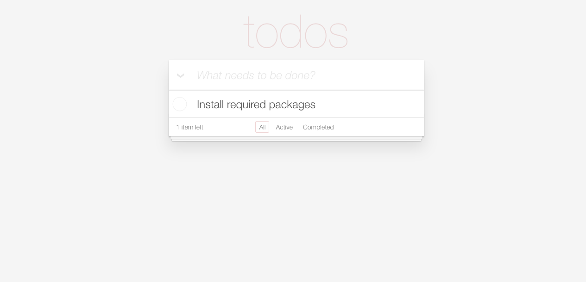

# todo-vuex

> A Vue.js project



## Using Vuejs template for webpack

```bash
$ npm install -g vue-cli
$ vue init webpack my-project
$ cd my-project
$ npm install
$ npm run dev
```
## Build Setup

``` bash
# install dependencies
npm install

# serve with hot reload at localhost:8080
npm run dev

# build for production with minification
npm run build

# run unit tests
npm run unit

# run e2e tests
npm run e2e

# run all tests
npm test
```

For detailed explanation on how things work, checkout the [guide](http://vuejs-templates.github.io/webpack/) and [docs for vue-loader](http://vuejs.github.io/vue-loader).
